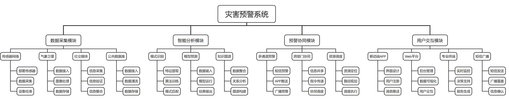
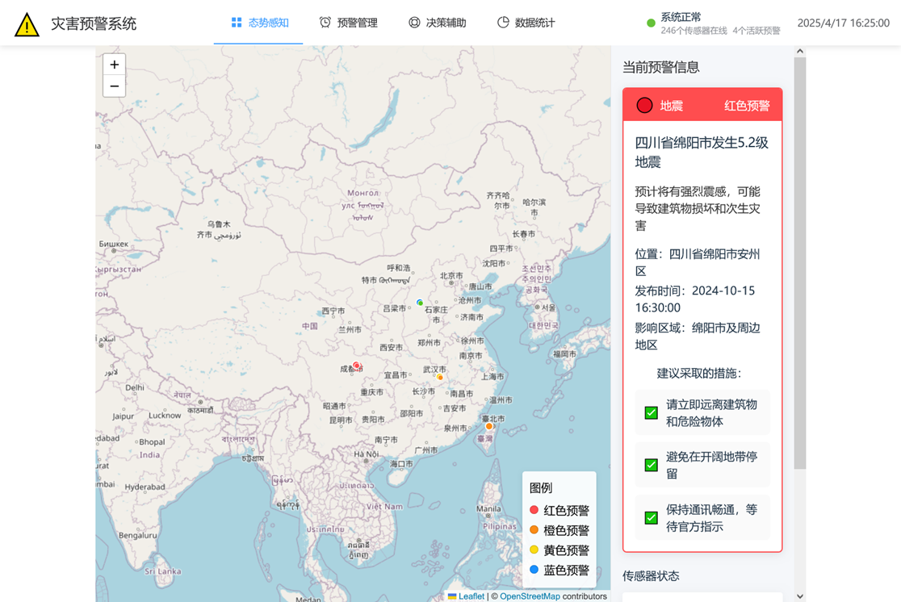
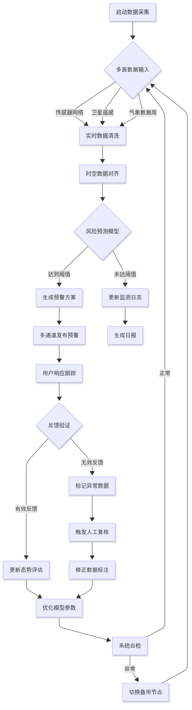
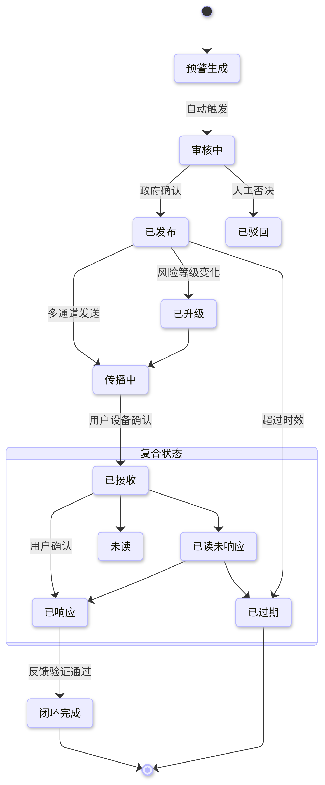
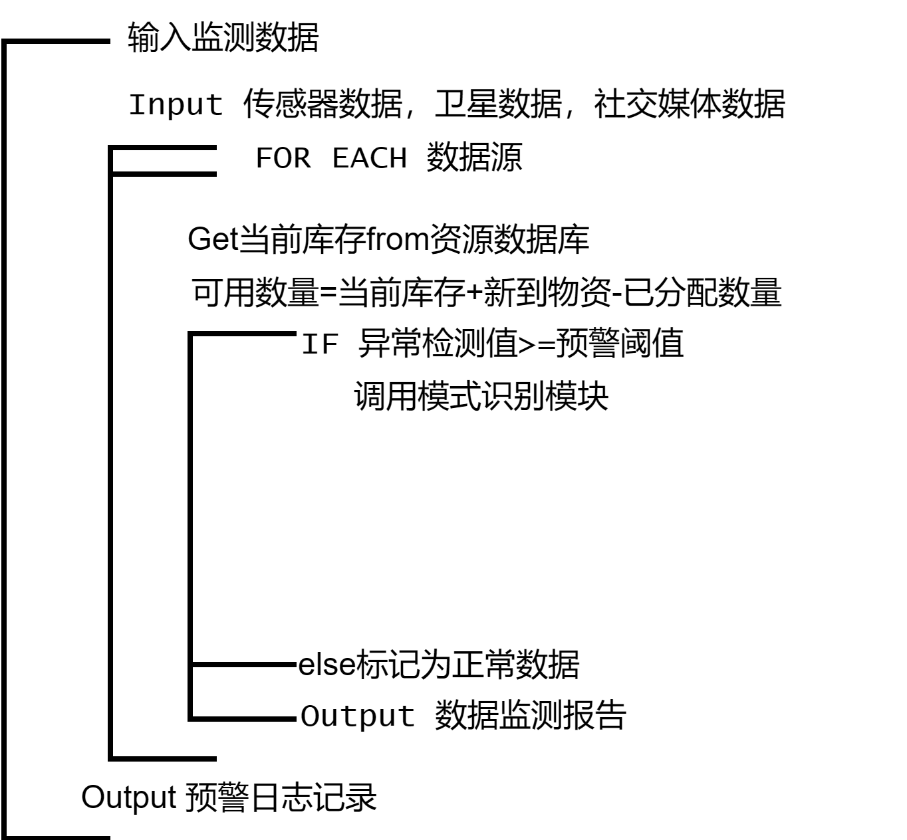
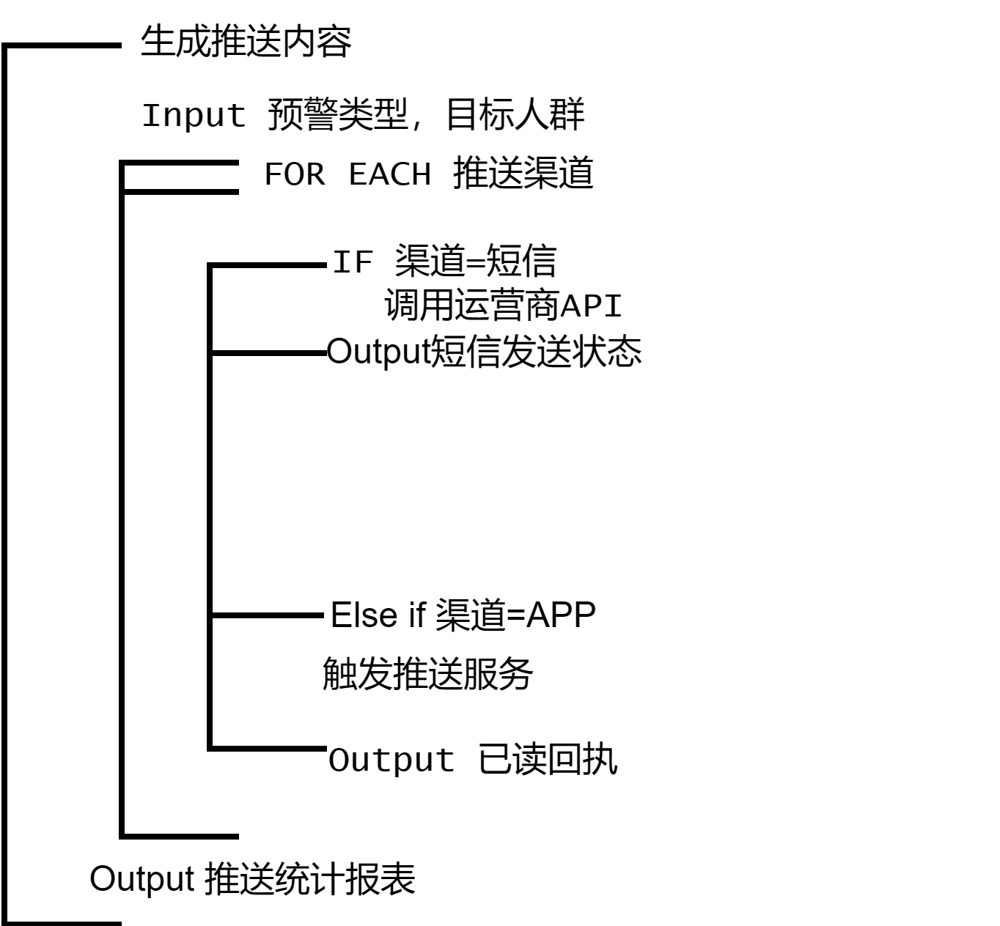
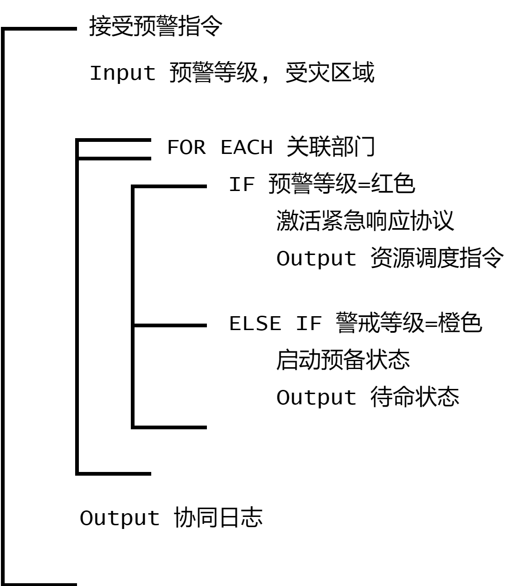
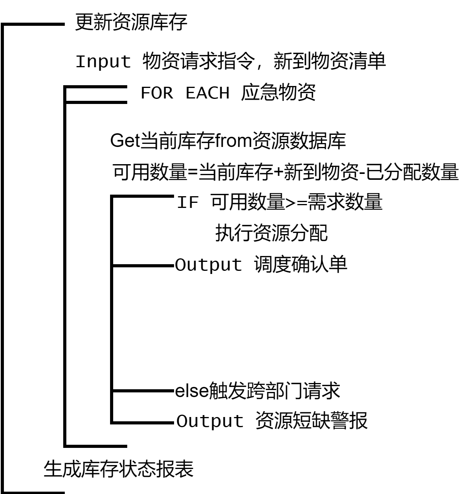
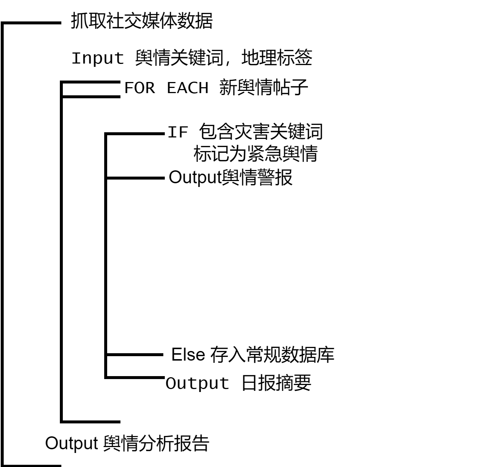

# 软件需求规格说明

## a. 引言

### a.1 目的
本文档旨在明确灾害预警系统的软件需求规格，为系统开发、设计、测试及验收提供基准依据。本系统致力于通过数字化技术提升灾害预警效率，优化预警服务质量，增强灾害预测与防控能力，实现政府、企业、公众的多方协同应对灾害。

### a.2 文档约定
#### a.2.1 术语定义
- 灾害预警系统：集成数据采集、智能分析、预警协同、用户交互等功能的综合性信息化系统。
- 角色：包括政府管理部门、企业、公众等。
- 关键功能：如数据采集可视化、智能分析预测、多通道预警等。
- 优先级：P0：核心功能，需优先开发。P1：重要功能，第二阶段实现。P2：辅助功能，按需迭代。

#### a.2.2 编写标准
需求描述遵循 IEEE 830-1998 标准，采用"需求类型（功能/非功能）+ 需求编号 + 需求描述"格式。

### a.3 预期的读者和阅读建议
#### a.3.1 预期读者
- 甲方及审核人：在查看原型前应先阅读此文档全部的内容，以便了解软件的开发进展情况。
- 系统开发者：在使用原型前应首先阅读此文档b、c、d部分的内容，以了解软件的开发要求和进展情况。
- 系统管理者：在使用原型前应首先阅读此文档b、c部分的内容，以了解本产品的定位，功能与基本使用操作。
- 普通用户：在使用原型前应首先阅读此文档的b部分，以了解该应用的基本特性以及功能。

#### a.3.2 阅读建议
- 概览全文：建议首次阅读时快速浏览目录及概述章节，建立整体认知；
- 按需深入：根据角色定位选择重点章节（如开发人员聚焦"功能需求"，测试人员关注"非功能需求"）；
- 交叉验证：结合用例图、流程图等附录文档辅助理解。

### a.4 产品的范围
该产品为政府部门、企业和公众提供智能化灾害预警平台，包括多源数据采集（物联网设备、卫星遥感、气象数据等）、智能分析预测（风险评估和预测）、预警协同（多部门联动响应）以及用户交互（多通道预警信息发布）等功能。服务对象为在系统覆盖区域内的所有单位和个人。

### a.5 参考文献
- 《国家突发事件预警信息发布系统建设规范（GB/T 27070-2015）》
- 《自然灾害风险区划技术规范（GB/T 38594-2020）》
- 《国家地震预警管理规定》

## b. 综合描述

### b.1 产品的前景
灾害预警系统处于政策推动与技术发展的黄金期。全球气候变化加剧、城市化进程加快以及极端天气频发，使得自然灾害和人为事故的破坏性显著增加。传统灾害预警系统依赖人工经验与孤立数据源，存在响应滞后、信息覆盖不全、预测精度不足等问题，难以应对复杂多变的灾害场景。通过融合物联网、人工智能、多源数据融合等新一代技术，构建一套实时感知、智能分析、精准预警的灾害预警系统，是提升社会灾害防控能力的迫切需求。

### b.2 产品的功能

灾害预警系统围绕"智能预测、精准预警、协同响应、公众保护"四大核心目标，提供以下功能模块：

1. **数据采集模块**：
   - 多源传感器数据接入与管理
   - 卫星遥感数据处理
   - 气象数据库集成
   - 历史灾害数据库维护

2. **智能分析模块**：
   - 时空数据对齐与清洗
   - 风险预测模型计算
   - 模型训练与优化
   - 灾害风险态势评估

3. **预警协同模块**：
   - 预警方案自动生成
   - 多部门协同指挥
   - 应急资源调度
   - 舆情监控与分析

4. **用户交互模块**：
   - 多通道预警信息发布
   - 用户反馈收集与验证
   - 个人防灾指导
   - 灾情上报与共享

### b.3 用户类和特征
该项目作为灾害预警管理系统，涉众群体主要包括：

1. **政府部门人员**：
   - 应急管理部门：负责灾害应对的总体协调
   - 气象部门：提供气象预报数据
   - 自然资源部门：监测地质灾害
   - 地方政府：负责本地区灾害防控

2. **企业用户**：
   - 高危行业企业：能源、化工、采矿等
   - 基础设施运营单位：交通、电力、水利等
   - 安全生产责任单位：按规定接入预警系统

3. **普通公众**：
   - 灾害高风险区域居民
   - 移动终端用户
   - 需特殊保护群体（老人、儿童、残障人士）

### b.4 运行环境
#### b.4.1 硬件环境
- 服务器端：集群部署，单节点最低配置为16核CPU/32GB内存/1TB SSD。
- 客户端：Web端支持Chrome/Firefox/Safari浏览器；移动端适配iOS/Android主流设备。
- 传感器网络：支持接入地震仪、水位传感器、气体检测仪等设备。

#### b.4.2 网络环境

- 带宽要求：核心节点≥1Gbps，边缘节点≥100Mbps。
- 延迟要求：核心功能响应≤500ms，预警发布延迟≤1分钟。
- 安全性：采用SSL/TLS加密传输，敏感数据加密存储。

### b.5 设计和实现上的限制
#### b.5.1 技术约束
- 系统需兼容现有国家突发事件预警信息发布系统。
- 预警信息发布延迟需≤1分钟。
- 边缘计算节点需支持断网时本地推理。

#### b.5.2 合规性
- 遵循《国家突发事件预警信息发布系统建设规范》
- 符合《自然灾害风险区划技术规范》标准
- 满足《个人信息保护法》要求

#### b.5.3 性能要求
- 并发处理：支持10万级用户同时接收预警
- 响应时间：核心API响应≤500ms
- 数据处理：支持TB级数据高速分析

### b.6 假设和依赖
#### b.6.1 外部依赖
- 依赖政府提供的基础地理信息系统(GIS)数据
- 依赖气象部门实时气象观测与预报数据
- 依赖通信运营商提供的GSM小区广播服务

#### b.6.2 技术假设
- 假设传感器网络覆盖主要灾害高风险区域
- 假设通信基础设施在灾害初期仍能正常运行
- 假设目标用户智能手机普及率≥80%

## c. 外部接口需求
### c.1 用户界面

#### c.1.1 角色适配性
- 支持多角色界面（政府部门、企业用户、普通公众），按权限动态展示功能模块
- 政府端集成指挥仪表盘（灾害态势、资源分布、响应状态）
- 公众端提供小程序/APP双入口，支持适老化模式（大字体、语音提示）

#### c.1.2 响应式设计
- 界面自动适配手机（屏幕<768px）、平板（768px-1024px）、PC（>1024px）
- 支持暗色模式，降低夜间使用时的视觉疲劳

#### c.1.3 交互规范
- 灾情上报支持文字+图片/视频上传（文件≤100MB）
- 预警信息采用醒目色彩标识不同等级（绿、黄、橙、红）
- 关键操作需二次确认，防止误操作

### c.2 硬件接口
- 支持主流物联网传感器（如水位传感器、气体检测仪、地震仪等）
- 支持卫星遥感数据接收设备
- 提供传感器接入SDK及标准协议文档

### c.3 软件接口
- 提供RESTful API接口，支持第三方系统集成
- 支持对接国家突发事件预警信息发布系统
- 提供开放数据接口，供科研机构分析使用

### c.4 通信接口
- 支持HTTP/HTTPS协议与服务器通信
- 支持WebSocket实时数据推送
- 支持MQTT协议连接物联网设备

## d. 系统特性
### d.1 说明和优先级

| 功能模块       | 功能描述                                 | 优先级 |
| -------------- | ---------------------------------------- | ------ |
| 多源数据采集   | 对接传感器网络、卫星遥感、气象数据库     | P0     |
| 智能风险分析   | 基于AI模型进行灾害风险预测               | P0     |
| 预警方案生成   | 自动生成包含避险建议的预警信息           | P0     |
| 多通道预警发布 | 通过APP推送、短信、GSM小区广播等发送预警 | P0     |
| 跨部门协同响应 | 支持多部门信息共享与协同决策             | P1     |
| 应急资源调度   | 智能规划救援物资与人员调配               | P1     |
| 用户反馈验证   | 验证用户上报信息真实性                   | P1     |
| 舆情监控分析   | 监测社交媒体灾情信息                     | P2     |

### d.2 激励/响应序列

- 传感器触发阈值 → 系统自动计算风险等级 → 生成预警方案 → 多通道发布预警信息 → 跟踪用户接收状态 → 收集用户反馈 → 优化预警策略
- 用户上报灾情 → 系统验证信息真实性 → 更新灾害态势图 → 通知相关部门 → 调度应急资源 → 跟踪处置进度 → 形成闭环反馈

### d.3 功能需求
- 数据采集：支持至少10种不同类型传感器数据接入，采样率≥10Hz
- 风险预测：支持8种主要灾害类型的预测，预测准确率≥85%
- 预警发布：预警信息从生成到发布延迟≤1分钟，覆盖率≥95%
- 协同响应：支持至少5个不同部门的协同操作，响应时间≤5分钟

## e. 其它非功能需求
### e.1 性能需求
- 系统并发处理能力：支持10万级用户同时接收预警信息
- 数据处理速度：传感器数据延迟≤500ms，卫星数据处理延迟≤5分钟
- 预警发布时效：从风险识别到预警发布完成≤1分钟
- 系统可用性：年可用率≥99.99%（全年累计不可用时间≤52.6分钟）

### e.2 安全设施需求
#### e.2.1 DDoS攻击防御
- 在符合《网络安全等级保护基本要求》三级标准下，部署流量清洗服务
- 设置API调用频率限制（单IP每分钟≤100次）
- 配置多层防火墙，隔离外网与核心业务系统

#### e.2.2 数据泄露防护
- 敏感数据加密存储，密钥分级管理
- 权限最小化原则，按角色分配操作权限
- 数据脱敏后再向第三方提供

#### e.2.3 服务中断应对
- 核心服务部署于多可用区，支持自动故障转移
- 本地缓存+边缘计算，支持临时断网状态下的基本功能
- 灾备系统实时同步，RTO≤15分钟，RPO≤5分钟

### e.3 安全性需求
- 系统需通过《信息系统安全等级保护》三级认证
- 用户认证采用双因素认证（密码+短信验证码）
- 预警信息发布需经过双人审核机制，防止误报

### e.4 业务规则
- 预警等级划分规则：绿色（无风险）、黄色（低风险）、橙色（中风险）、红色（高风险）
- 信息发布权限：红色预警需政府部门最终确认，其他等级可由系统自动发布
- 用户信息验证：地理位置偏差≤1km且时间戳偏差≤10分钟视为有效信息

### e.5 用户文档
- 用户操作手册：包含政府端/企业端/公众端操作指南
- API文档：提供第三方集成接口文档
- 应急预案模板：提供标准化灾害应对预案模板

## f. 其它需求
- 国际化：支持中文/英文界面切换
- 可扩展性：支持后续扩展更多灾害类型和预警场景
- 兼容性：适配主流浏览器和移动设备操作系统

## 附录A: 词汇表
| 术语         | 描述                                             |
| ------------ | ------------------------------------------------ |
| 多源数据融合 | 将来自不同传感器、卫星、数据库的信息统一处理分析 |
| 预警等级     | 灾害风险程度分级（绿、黄、橙、红四级）           |
| GSM小区广播  | 通过移动通信基站向特定区域所有手机发送预警信息   |
| 边缘计算     | 在网络边缘执行计算任务，减少数据传输延迟         |

## 附录B：分析模型

### 1. 数据流图（DFD）
#### 上下文图

#### DFD 0层

#### DFD 1层 - 数据采集

#### DFD 1层 - 智能分析

#### DFD 1层 - 预警协同系统

#### DFD 1层 - 用户交互

### 2. 实体关系图（ERD）
使用数据建模部分的实体关系图。

### 3. 预警生命周期状态图

### 4. 多通道预警顺序图

### 5. 行为模型图

#### 预警触发流程

#### 预警信息推送

#### 多部门协同响应

#### 应急资源调度

#### 舆情监控与分析

## 附录C: 待确定问题的列表
1. 区域预警信息发布的权限审批流程有待细化
2. 不同类型灾害的风险评估模型参数需进一步确定
3. 与第三方预警系统的接口标准需进一步协商
