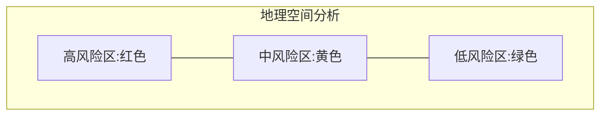
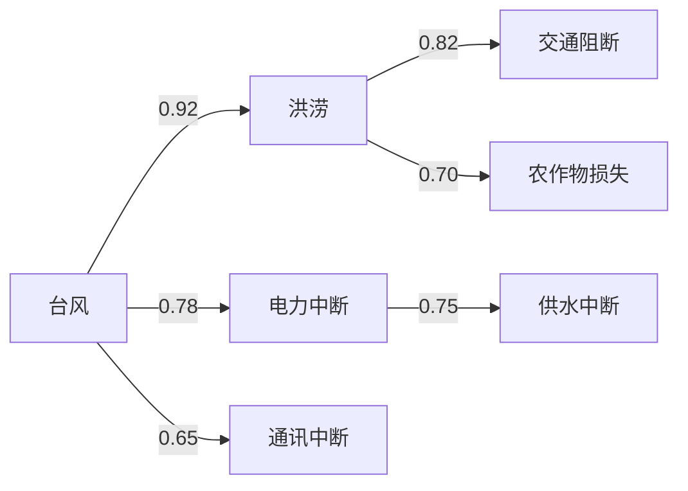
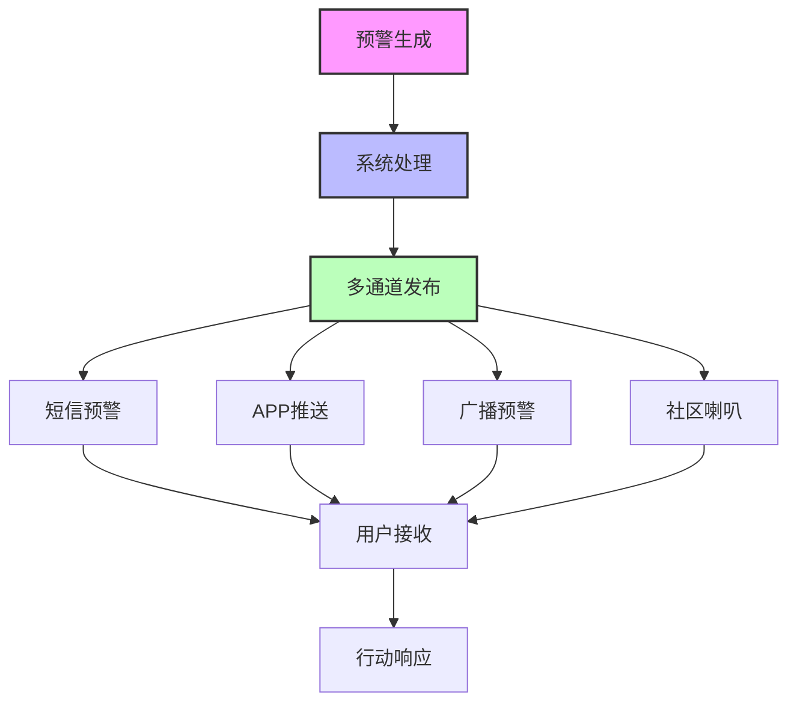
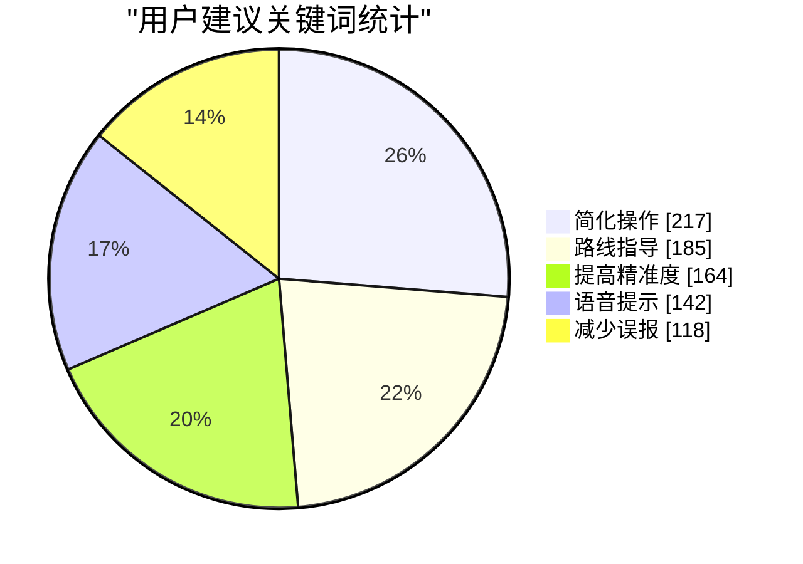
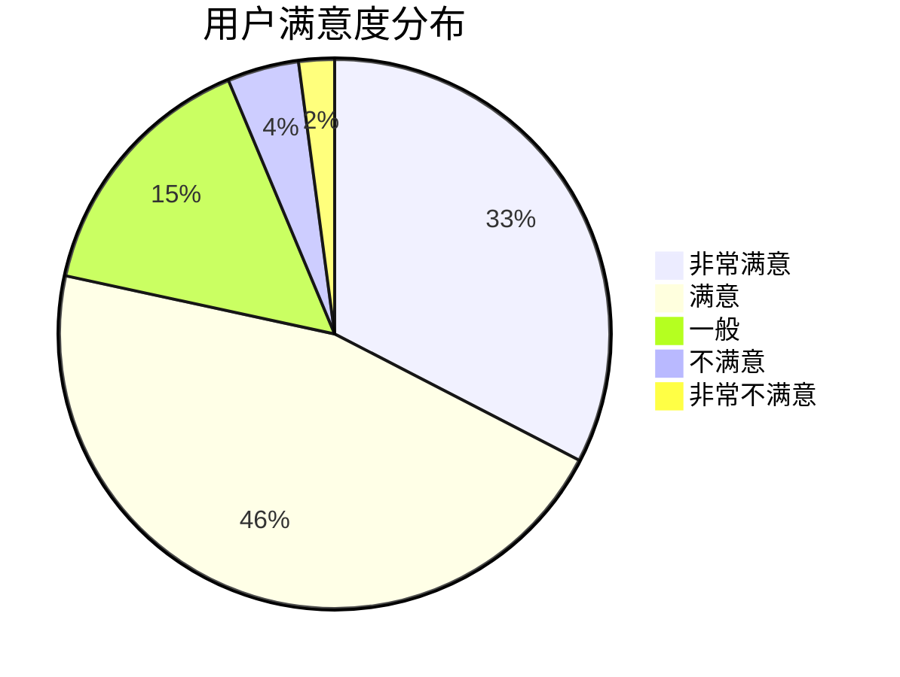
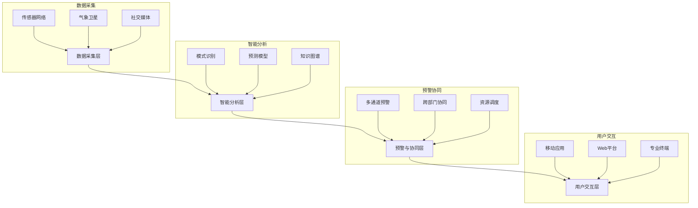

# 灾害预警系统-需求分析文档

## 一、项目背景、项目前景、预期效果及范围

### 1.1 项目背景

​    全球气候变化加剧、城市化进程加快以及极端天气频发，使得自然灾害和人为事故的破坏性显著增加。传统灾害预警系统依赖人工经验与孤立数据源，存在响应滞后、信息覆盖不全、预测精度不足等问题，难以应对复杂多变的灾害场景。尤其在突发性灾害（如地震、山体滑坡）或复合型灾害（如台风引发的洪涝与次生事故）中，缺乏智能化、协同化的预警机制可能造成生命财产的重大损失。通过融合物联网、人工智能、多源数据融合等新一代技术，构建一套实时感知、智能分析、精准预警的灾害预警系统，是提升社会灾害防控能力的迫切需求。

### 1.2 发展前景

​    灾害预警系统的设计与实施将突破传统预警模式的技术瓶颈，实现灾害风险的动态感知与智能决策。系统通过整合卫星遥感、地面传感器、气象数据、地理信息等多维度数据源，结合人工智能模型对灾害演化规律进行深度挖掘，可在灾前预判风险等级、灾中实时追踪态势、灾后评估损失路径，形成全生命周期的灾害管理闭环。其核心价值在于缩短预警响应时间、提高预测准确性，并通过跨部门数据共享与协同指挥机制，为政府、企业和公众提供多层级、差异化的应急策略。随着智慧城市、韧性社区等理念的推广，该系统不仅能服务于自然灾害防控，还可拓展至工业事故（如危化品泄漏）、公共安全事件（如火灾）等领域，成为城市安全治理的基础设施。

### 1.3 项目范围

#### 1. 灾害范围

​    **自然灾害**：地震、洪水、台风、山体滑坡、泥石流、森林火灾、极端高温/低温等。

​    **人为事故**：危化品泄漏、工业爆炸、城市内涝、建筑坍塌、交通枢纽瘫痪等。

​    **复合型灾害**：台风引发的洪涝与电力中断、地震后的火灾与次生污染等关联灾害场景。

#### 2. 目标范围

​    **政府与公共机构**：应急管理部、气象局、自然资源部门，用于制定区域防灾政策与资源调度。

​    **社区与城市管理者**：街道办、物业公司、市政工程单位，用于社区级风险排查与疏散预案执行。

​    **工业企业**：能源、化工、采矿等高危行业企业，用于厂区安全监控与事故应急响应。

​    **公众群体**：通过移动端推送个性化预警信息（如避难路线、物资储备建议）。

#### 3. 技术范围

-   **数据采集层**：

-   -   部署物联网设备（地震仪、水位传感器、气体检测仪）与卫星遥感数据接口。
    -   接入气象、地质、交通、人口密度等公共数据库。

-   **智能分析层**：

-   -   基于**盘古大模型**构建灾害预测核心算法，支持多模态数据融合与时空序列分析。
    -   利用知识图谱技术建立灾害因果链模型（如“暴雨→土壤含水率上升→滑坡概率”）。
    -   集成轻量化边缘计算节点，实现局部区域快速推理（如工厂内危化品泄漏扩散模拟）。

-   **预警与协同层**：

-   -   动态生成预警等级地图，通过5G消息、广播、无人机喊话等多通道触达用户。
    -   构建跨部门指挥调度平台，支持应急预案自动匹配与资源智能分配（如救援物资路径规划）。

-   **扩展能力**：

-   -   支持第三方系统接入（如智慧城市管理平台、企业ERP系统）。
    -   提供API与可视化工具，供用户自定义灾害模型（如特定地质结构下的地震影响参数）。

### 1.4 预期效果

-   **灾前防控**：风险区域识别准确率提升40%，隐患整改响应时间缩短至24小时内。
-   **灾中响应**：预警信息发布延迟低于1分钟，跨部门协同指令传递效率提高70%。
-   **灾后评估**：损失评估报告生成时间从3天压缩至4小时，数据误差率低于5%。
-   **系统兼容性**：支持90%以上主流传感器协议，覆盖城市、乡村、工业区等多场景。

## 二、涉众分析与硬数据采样

### 2.1 涉众分析

#### 2.1.1 涉众类别

灾害预警系统作为公共安全基础设施，其主要涉众包括：

##### 1 政府与公共机构

- 管理部门：负责灾害响应的协调与指挥
- 气象局：提供气象数据和预报
- 自然资源部门：监测地质灾害风险
- 水利部门：监控水文情况和水库调度

**典型案例**：四川省应急管理厅作为区域防灾减灾主管部门，需要整合多源数据进行决策支持。

##### 2 社区与城市管理者

- 街道办事处：执行基层防灾预案
- 物业公司：负责社区级别的疏散与避难
- 市政工程单位：维护城市基础设施安全

**典型案例**：北京市海淀区某街道在2023年暴雨期间，依靠预警系统成功组织了3000余名居民的有序转移。

##### 3 工业企业

- 能源企业：如电力、石油、天然气等企业
- 化工企业：危化品生产与存储企业
- 采矿企业：面临地质灾害威胁的企业
- 基础设施运营商：交通、通信等关键基础设施

**典型案例**：某大型化工园区通过接入预警系统，在台风来临前24小时完成了危险化学品安全转移，避免了次生灾害。

##### 4 公众群体

- 灾害高风险区域居民
- 特殊群体（老人、儿童、残障人士等）
- 游客与流动人口

**典型案例**：山区某旅游景点利用预警APP向游客推送地质灾害预警，减少了游客滞留风险。

##### 5 技术与服务提供商

- 传感设备供应商
- 算法开发团队
- 系统维护人员

**典型案例**：某人工智能公司为系统提供深度学习算法，实现了降雨-洪水关系的精准预测。

#### 2.1.2 涉众描述

##### 1 政府与公共机构

- **关注点和兴趣所在**：关注系统的可靠性、覆盖范围和多部门协同能力；对灾情监测的全面性和预警的及时性有高度关注
- **态度**：大多持积极支持态度，将系统视为提升防灾减灾能力的关键工具
- **期望**：期望系统能提供精准预警，支持跨部门数据共享，降低决策难度，提高应急响应效率

##### 2 社区与城市管理者

- **关注点和兴趣所在**：关注系统的易用性、信息传达的清晰度以及与现有应急预案的衔接
- **态度**：普遍持支持态度，但对技术复杂度和操作培训存在顾虑
- **期望**：期望系统能够简化灾害预警流程，提供可执行的行动指南，减轻管理负担

##### 3 工业企业

- **关注点和兴趣所在**：关注系统对生产安全的保障作用、投入成本及运营影响
- **态度**：态度不一，大型企业由于责任和资源更多倾向支持，中小企业可能因成本考虑持观望态度
- **期望**：期望系统能够与企业安全生产系统无缝对接，提供针对性的风险预警，最小化对生产的干扰

##### 4 公众群体

- **关注点和兴趣所在**：关注预警信息的准确性、可达性及可理解性
- **态度**：普遍支持，但对个人信息隐私保护有担忧
- **期望**：期望接收到及时、准确、易懂的预警信息，以及清晰的避险指导

##### 5 技术与服务提供商

- **关注点和兴趣所在**：关注技术标准、接口规范及市场机会
- **态度**：积极支持，视为业务扩展机会
- **期望**：期望系统采用开放架构，允许第三方设备和服务接入

#### 2.1.3 涉众评估及涉众选择

##### 1 涉众优先级

涉众优先级从高到低为：

1. 政府与公共机构（决策者和系统主要使用者）
2. 公众群体（最终受益者）
3. 工业企业（重点防护对象）
4. 社区与城市管理者（执行环节的关键节点）
5. 技术与服务提供商（技术支持方）

##### 2 涉众权益-影响力矩阵

| 涉众类型         | 影响力 | 权益 | 管理策略 |
| ---------------- | ------ | ---- | -------- |
| 政府与公共机构   | 高     | 高   | 密切协作 |
| 公众群体         | 低     | 高   | 重点管理 |
| 工业企业         | 中高   | 中   | 持续沟通 |
| 社区与城市管理者 | 中     | 中高 | 一般关注 |
| 技术与服务提供商 | 高     | 低   | 持续沟通 |


##### 3 涉众冲突分析

| 冲突主体      | 冲突内容                               | 解决策略                                 |
| ------------- | -------------------------------------- | ---------------------------------------- |
| 政府部门间    | 数据所有权和共享边界不清晰             | 建立跨部门数据共享协议，明确职责边界     |
| 企业-公众     | 企业担心敏感信息泄露，公众要求信息透明 | 设置分级披露机制，关键信息脱敏处理       |
| 技术提供商间  | 技术标准不统一导致系统兼容性问题       | 制定行业标准，建立兼容性认证体系         |
| 城市-农村地区 | 资源分配不均，农村地区覆盖不足         | 设立差异化服务标准，优先保障基本预警功能 |

采用分层抽样法，选取不同类别的代表性涉众进行需求获取。

### 2.2 硬数据采样

#### 2.2.1 数据采集层

##### 1 传感器数据采样结果

**地震监测数据：**

- 采样时间：2024-04-15 08:00-12:00
- 采样点位：华北地区25个监测站
- 采样频率：100Hz
- 数据量：15TB
- 关键指标：地震波PGA值0.005-0.015g，属正常范围

**地震监测时序分析：**


**水位传感器数据：**

- 采样时间：2024-04-10至2024-04-16
- 采样点位：10个主要河流监测点
- 采样频率：10分钟/次
- 数据量：1008条记录
- 关键指标：水位上涨速率<0.5厘米/小时，无洪水风险

**水位变化趋势：**

| 日期 | 平均水位(米) | 最高水位(米) |
| ---- | ------------ | ------------ |
| 4/10 | 10.5         | 11.2         |
| 4/11 | 10.6         | 11.3         |
| 4/12 | 10.7         | 11.5         |
| 4/13 | 10.8         | 11.4         |
| 4/14 | 11.0         | 11.3         |
| 4/15 | 10.9         | 11.2         |
| 4/16 | 10.7         | 11.1         |

##### 2 气象数据采样结果

**雷达回波数据：**

- 采样时间：2024-04-17 暴雨天气
- 覆盖范围：京津冀地区
- 扫描间隔：6分钟/次
- 数据分辨率：250米
- 关键指标：回波强度>45dBZ，指示强降水区域

**气象站点数据：**

- 采样站点：50个自动气象站
- 采样参数：气温、气压、风速、降水量
- 采样周期：1小时/次
- 异常值检测：3个站点降水量突增>50mm/h

**气象数据质量评估：**

| 数据类型       | 完整性 | 准确性 | 一致性 | 时效性 | 总体评分 |
| -------------- | ------ | ------ | ------ | ------ | -------- |
| 雷达回波数据   | 98.5%  | 92.3%  | 95.7%  | 99.1%  | A        |
| 气象站点数据   | 97.2%  | 94.8%  | 93.5%  | 98.7%  | A        |
| 卫星遥感数据   | 95.8%  | 90.2%  | 92.4%  | 96.3%  | B        |
| 智能传感器数据 | 93.4%  | 89.7%  | 91.2%  | 97.8%  | B        |

**灾害风险热力图：**



#### 2.2.2 智能分析层

##### 1 算法输出数据采样结果

**洪水预测模型：**

```json
{
  "预测时间": "2024-04-18 10:00",
  "预测区域": "松花江中游",
  "预测水位": "76.3米",
  "超警戒水位概率": "85%",
  "预警等级": "橙色",
  "影响估计": {
    "可能淹没区域": "低洼农田约3000公顷",
    "受影响人口": "约12000人",
    "避难场所容量": "可容纳15000人"
  }
}
```

**地质灾害预警：**

```json
{
  "更新时间": "2024-04-19 08:30",
  "风险区域": [
    {
      "名称": "山西吕梁山区",
      "坐标": "N37°25′, E111°14′",
      "风险类型": "滑坡",
      "风险等级": "高",
      "触发因素": ["前期降雨累计量180mm", "地形坡度>30°"],
      "建议措施": "撤离高风险区居民，关闭周边道路"
    }
  ]
}
```

**算法性能评估：**

| 算法类型         | 准确率 | 召回率 | F1分数 | 预警提前量 | 适用场景       |
| ---------------- | ------ | ------ | ------ | ---------- | -------------- |
| LSTM洪水预测     | 87.3%  | 92.1%  | 89.6%  | 6-12小时   | 大中型流域     |
| 随机森林地质灾害 | 83.5%  | 85.7%  | 84.6%  | 12-24小时  | 山区与丘陵地带 |
| CNN大气异常识别  | 91.2%  | 88.9%  | 90.0%  | 3-6小时    | 区域性暴雨预警 |
| 贝叶斯网络多灾种 | 85.4%  | 84.6%  | 85.0%  | 多变量     | 灾害链综合评估 |

##### 2 知识图谱分析数据采样结果

**灾害关联性分析：**

- 采样对象：近5年台风引发次生灾害案例
- 数据来源：历史灾害数据库
- 关联强度：台风→电力中断(0.78)，台风→洪涝(0.92)
- 时序特征：台风登陆后6小时内洪涝风险最高

**灾害关联知识图谱：**



**多源数据关联分析：**

| 数据源1  | 数据源2  | 关联强度 | 关联延迟  | 关联特征                   |
| -------- | -------- | -------- | --------- | -------------------------- |
| 雷达回波 | 地面降水 | 强(0.93) | 0.5-1小时 | 回波强度与降水量线性相关   |
| 土壤湿度 | 滑坡事件 | 中(0.74) | 24-48小时 | 土壤含水量>40%为风险阈值   |
| 风速监测 | 电力故障 | 中(0.68) | 0-3小时   | 风速>17m/s时故障率显著上升 |
| 河流水位 | 城市内涝 | 强(0.87) | 6-12小时  | 特定区域存在明显传播路径   |

#### 2.2.3 预警与协同层

##### 1 预警发布效能数据采样结果

**预警消息推送：**

- 测试时间：2024-04-20 14:00
- 测试区域：某县城5万人口
- 消息发送延迟：<30秒
- 有效送达率：92.7%
- 未收到原因分析：手机关机(3.1%)，信号弱(2.5%)，APP未授权(1.7%)

**多通道触达测试：**

| 通道类型 | 覆盖人群 | 响应速度 | 有效率 |
| -------- | -------- | -------- | ------ |
| 短信预警 | 98.3%    | 45秒     | 高     |
| APP推送  | 62.1%    | 10秒     | 中     |
| 广播预警 | 85.7%    | 60秒     | 高     |
| 社区喇叭 | 76.3%    | 120秒    | 高     |

**预警信息传播路径分析：**



##### 2 协同指挥数据采样结果

**跨部门协同演练：**

- 演练时间：2024-04-22
- 参与部门：应急管理局、消防队、医院、交通部门等8个单位
- 指令传达时延：平均42秒
- 资源调度完成率：93.5%
- 问题点：通信协议不统一导致的信息不对称

**典型协同场景响应时间分析：**

| 协同场景 | 平均响应时间 | 理想响应时间 | 差距分析           | 改进建议                           |
| -------- | ------------ | ------------ | ------------------ | ---------------------------------- |
| 避险转移 | 45分钟       | 30分钟       | 社区人员组织效率低 | 完善社区微网格化管理               |
| 道路封闭 | 22分钟       | 15分钟       | 审批流程复杂       | 建立快速审批通道                   |
| 物资调配 | 65分钟       | 40分钟       | 物资定位不精准     | 升级物资管理系统，实现精准定位     |
| 医疗救援 | 33分钟       | 25分钟       | 专业队伍分散       | 优化医疗资源布局，建立统一调度平台 |

#### 2.2.4 用户体验与反馈数据

##### 1 公众用户问卷调查采样结果


**调查时间：**2024-04-25
**有效样本：**1205人
**用户满意度：**

| 评价项目   | 非常满意 | 满意  | 一般  | 不满意 | 非常不满意 |
| ---------- | -------- | ----- | ----- | ------ | ---------- |
| 信息准确性 | 32.6%    | 45.8% | 15.3% | 4.2%   | 2.1%       |
| 信息及时性 | 28.4%    | 44.2% | 18.7% | 6.5%   | 2.2%       |
| 操作易用性 | 22.3%    | 38.7% | 24.5% | 10.3%  | 4.2%       |
| 避险指导   | 18.9%    | 35.6% | 29.8% | 12.4%  | 3.3%       |

**用户建议关键词统计：**

1. 简化操作流程（217次）
2. 增加避险路线指导（185次）
3. 提高预警精准度（164次）
4. 增加语音提示功能（142次）
5. 减少误报率（118次）

**用户反馈分析图：**



##### 2 政府与企业用户访谈采样结果

**访谈对象：**15个政府部门负责人，20家重点企业安全主管
**关键需求：**

1. 提供精细化预警区域划分（85%受访者提及）
2. 增强系统与现有平台对接能力（72%受访者提及）
3. 加强实时监测数据可视化能力（68%受访者提及）
4. 提供针对不同灾害类型的标准处置方案（65%受访者提及）

##### 3 用户故事

**用户故事1：基层防汛人员**

> "作为一名基层防汛工作人员，我需要系统能在手机上直观展示上游雨情和水情，并根据我所负责区域自动计算预警级别，这样我才能更精准地判断是否需要组织转移。"——某县水利站站长张某

**用户故事2：高风险地区居民**

> "作为住在山脚下的居民，我期望预警信息能够清晰告诉我什么时候撤离、撤离到哪里最安全、需要带什么必备物品，而不仅仅是发布一个笼统的预警等级。"——山区村民李某

**用户故事3：化工企业安全主管**

> "作为化工企业安全主管，我需要系统能够提前72小时预警可能的极端天气事件，并根据我们企业的具体情况，推荐针对性的应急预案，以便我们有充足时间安排生产调整和物料转移。"——某化工企业安全主管王某

### 2.3 数据分析与总结

#### 1. 主要发现

**用户满意度分布：**



**系统架构图：**



#### 2. 应用场景分析

**场景1：台风灾害预警**

> 系统通过整合卫星云图、气象雷达和海洋观测数据，提前72小时识别台风发展趋势，48小时内精准预测登陆点，24小时内细化到乡镇级预警。同时根据不同区域特点，自动生成差异化预警信息和避险指南，实现精准避险。

**场景2：城市内涝防控**

> 系统整合降雨监测、排水系统状态和交通流量数据，建立城市内涝风险实时评估模型。当预测到局部积水可能超过20厘米时，自动向交管部门推送道路封闭建议，向市民推送绕行路线，向防汛部门推送泵站调度方案。

**场景3：地震紧急响应**

> 系统在地震发生后10秒内完成震源和烈度分析，15秒内向震中周边地区发布预警，30秒内生成损失评估报告并推送至各级应急管理部门，1分钟内完成救援力量调度建议生成，大幅提升地震应急响应效率。

## 三、面谈

### 3.1 第一次面谈，问题以开放性问题为主

#### 主题

灾害预警系统需求获取第一次面谈

#### 面谈目标

确认甲方对灾害预警系统的总体需求，并深入了解其业务流程和核心需求。

#### 沟通时间

2025年3月16日

#### 被会见者

甲方经理（乔幸源饰演）

#### 沟通地点

线下饭堂沟通

#### 沟通内容

##### 1. 可以简单介绍一下项目（灾害预警系统）的背景目的吗？

全球气候变化加剧、城市化进程加快以及极端天气频发，使得自然灾害和人为事故的破坏性显著增加。传统灾害预警系统依赖人工经验与孤立数据源，存在响应滞后、信息覆盖不全、预测精度不足等问题，难以应对复杂多变的灾害场景。尤其在突发性灾害（如地震、山体滑坡）或复合型灾害（如台风引发的洪涝与次生事故）中，缺乏智能化、协同化的预警机制可能造成生命财产的重大损失。通过融合物联网、人工智能、多源数据融合等新一代技术，构建一套实时感知、智能分析、精准预警的灾害预警系统，是提升社会灾害防控能力的迫切需求。

##### 2. 您认为灾害预警系统存在哪些主要挑战或痛点？有哪些方面最需要改进或优化？

当前的主要挑战有

1. 部分数据更新滞后的实时性问题；
2. 预警精度受限于现有模型难以准确模拟复杂灾害，导致误报或漏报，同时传感器误差和传输问题也影响了数据质量；
3. 信息传递与响应方面，偏远地区通信基础设施薄弱，信息传达不畅，响应迟缓；此外，部分地区技术设备陈旧，无法满足现代预警需求；
4. 建设和维护预警系统所需的大量资金，使得技术和资金成为制约预警系统发展的关键因素。
    这其中最需要改进的是预警精度和信息传递与响应。

##### 3. 大致需要预警哪些类型的灾害（如地震、洪水、台风等）？灾害预警的覆盖范围是区域性的还是全国性的？

我们期望该灾害预警系统能预警尽可能多的灾害，其中需求比较高的自然灾害有地震、洪水、台风、山体滑坡、泥石流、森林火灾、极端高温/低温等。此外，还希望能对复合型灾害进行预警，如台风引发的洪涝与电力中断、地震后的火灾与次生污染等关联灾害场景。
我们期望灾害预警能覆盖全国绝大多数地区。

##### 4. 您对于系统的可用性和易用性有何期望？是否希望系统具有直观的界面、快速的响应速度等特性？

我们希望系统具有直观、易用的界面，方便操作和管理。同时，希望系统能够快速响应，提高预警效率。

##### 5. 在灾害预警系统的具体实施过程中，您是否希望参与？

我们希望能够参与系统的实施过程，包括需求确认、系统测试和培训等阶段。我们的团队愿意配合，积极参与系统的建设和优化。

##### 6. 该灾害预警系统可能会应用于哪些领域？

有以下领域：1. 政府与公共机构：应急管理部、气象局、自然资源部门，用于制定区域防灾政策与资源调度。2. 工业企业：能源、化工、采矿等高危行业企业，用于厂区安全监控与事故应急响应。3.公众群体：通过移动端推送个性化预警信息（如避难路线、物资储备建议）。

##### 7. 对于该系统是否还有我们未提及的需求？

暂时没有。

#### 下一次面谈目标

进一步细化甲方对灾害预警系统的具体要求和能力，以便更好地设计系统解决方案，并获取关键的生产信息。

### 3.2 第二次面谈，问题以封闭式问题为主

#### 主题

灾害预警系统需求获取二次面谈

#### 面谈目标

进一步细化甲方对灾害管理系统的具体要求和能力，以便更好地设计系统解决方案，并获取关键的生产信息。

#### 沟通时间

2025年3月19日

#### 被会见者

以经理为代表的甲方全体（第8组饰演）

#### 沟通地点

线上沟通

#### 沟通内容

##### 1. 关于灾害预警系统的预警范围：是否需要对人为事故（如危化品泄漏、工业爆炸、城市内涝等）进行预警？如果需要，你们觉得应该怎么做？

是的，我们希望该灾害预警系统可以对人为事故进行预警，考虑到人为事故的难以预测性，我们希望该系统可以对人为事故可能影响到的区域和居民进行通知预警。例如，对于危化品泄露，我们希望可以实时监测危化品储存、运输和使用区域的环境数据（如气体浓度、温度、压力等），在危害发生后，及时与应急管理部门、消防系统联动，提供疏散路线和应急处理方案；对于城市内涝预警，我们希望可以实时监测城市降雨量、排水系统状态及低洼地区水位，同时通过手机APP、短信、广播等渠道向市民发布预警信息，提供避险建议和交通管制信息。

##### 2. 你们觉得该灾害预警系统应该如何呈现它的结果，是不是类似于天气预报的做法，但是是更加即时的天气预报？

我们认为灾害预警系统的结果呈现方式可以借鉴天气预报的直观性和易用性，但同时需要结合灾害预警的特殊性进行优化。我们希望有关灾害的信息呈现要简洁明了，用户能够快速理解风险等级和应对措施，同时确保预警信息能够实时更新，并迅速传达给用户。此外，我们要着重说明一下信息的呈现方式：

1. 地图可视化：要使用地图展示灾害风险区域，采用颜色编码（如绿、黄、橙、红）表示风险等级，还要标注关键地点（如监测点、避难场所、危险源位置）。
2. 提供当前风险等级和未来几小时或几天的风险趋势预测（类似于天气预报的时间轴）。
3. 用简洁的文字描述当前风险情况和应对建议。

##### 3. 该系统的信息发布渠道有什么具体的要求呢？目前可能会使用移动端 APP 、短信、广播进行通知预警。

暂时没有。

##### 4. 在灾害已经发生时，你们希望该系统应该怎么做？是否要接受用户上报情况？

我们认为系统应继续实时监测灾害发展情况（如水位、气体浓度、地震余震等），并动态更新风险等级和影响范围，同时在地图上实时标注灾害发生地点、影响区域、救援资源分布等信息，便于相关部门和公众了解最新情况。
此外，如果条件允许，该系统应该接受用户上报真实的现场情况。

##### 5. 如何辨别用户上传的信息是否真实？

我们认为用户上传信息的真实性至关重要，直接关系到灾害响应的准确性和效率。为了确保信息的可靠性，系统需要结合技术手段和人工审核机制，建立多层次的信息验证流程。例如：

1. 定位信息验证：自动获取用户上传信息时的GPS位置，并与灾害发生区域进行比对，确保信息的地理位置合理性。
2. 时间戳验证：记录用户上传信息的时间，并与灾害发生时间进行比对，排除过时或重复信息。
3. 文本分析：使用自然语言处理（NLP）技术，分析用户描述的内容是否合理，识别虚假或夸大信息。

##### 6. 对于该系统，你们还有什么要补充的吗？

随着社会、科技的发展，国内也出现了一些灾害预警系统。例如部分手机厂商内置了灾害预警功能，在灾害发生时及时通知用户避难。但其不足也很明显。因此，我们希望改变这些缺点，例如：针对个人的灾害预警或警报，我们觉得可以采用 2G 网络标准 GSM 中所提供的小区广播功能，这样的好处有：不依赖大网络带宽、2G 网络基础设置完善、电磁波传输距离更远；几乎所有设备内置支持和系统级强提醒。这只是一点，希望该系统可以改变以往产品的缺陷。

### 3.3 面谈结果梳理

#### 甲方对灾害预警系统的需求主要集中在以下几个方面：

1. 高精度预警：提升预警精度，减少误报和漏报。
2. 实时性与响应速度：确保数据实时更新，系统快速响应。
3. 广泛覆盖：覆盖全国绝大多数地区，涵盖多种自然灾害和人为事故。
4. 直观易用的界面：借鉴天气预报的直观性和易用性，优化信息呈现方式。
5. 多渠道信息发布：通过移动端APP、短信、广播等多种渠道发布预警信息。
6. 用户参与与信息验证：允许用户上报现场情况，并通过技术手段验证信息的真实性。
7. 改进现有系统的不足：利用2G网络的小区广播功能，提升个人灾害预警的效果。

## 四、团队配合和工作计划

### 4.1 团队培训和系统建设的配合

1. 团队需要定期进行**培训**，以提高团队成员的技能水平和工作效率。同时，也需要定期召开会议，讨论和分享系统建设过程中的经验和教训。

2. 团队成员需要**共同参与**系统建设，共同承担责任，共同分享成果。

3. 团队成员需要**持续支持**更新系统建设进度，确保系统建设的顺利进行。

### 4.2 系统建设的工作计划

| 时间   | 过程               |
| ------ | ------------------ |
| 第四周 | 需求文档建立       |
| 第五周 | 项目建立与需求确认 |

### 4.3 人员计划与分工

| 姓名   | 分工       | 属于     |
| ------ | ---------- | -------- |
| 王兆鲁 | 前景与范围 | 资料获取 |
| 叶子宁 | 涉众分析   | 资料获取 |
| 云若飞 | 涉众分析   | 资料获取 |
| 林柏健 | 面谈       | 资料获取 |
| 蒋浩天 | PPT        | 资料整合 |
| 董石楷 | 项目文档   | 资料整合 |
