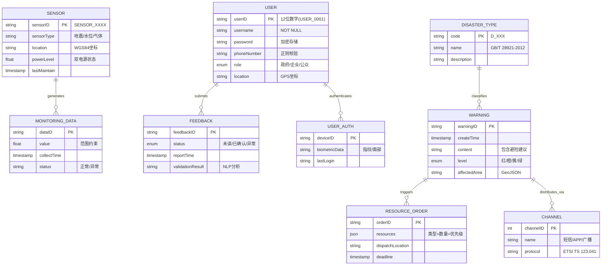

# 结构化分析

## 功能分解


灾害预警系统的主要功能模块可分为以下几个部分：

1. **数据采集模块**：负责从多源传感器、卫星遥感、气象数据库等获取实时数据
2. **智能分析模块**：处理采集的数据，进行风险评估和预测
3. **预警协同模块**：基于分析结果生成预警方案，协调多部门响应
4. **用户交互模块**：向用户发送预警信息，接收用户反馈

## 需求细化

| 需求编号 |                              A1                              |
| -------- | :----------------------------------------------------------: |
| 需求描述 |                   数据采集模块的可视化展示                   |
| 源头     |        针对甲方对于数据采集界面的要求概括出的详细需求        |
| 成本需要 | 在现有页面上增加设计模块，或者设计一个新的页面进行可视化展示 |
| 可变性   |           较高，可能随着开发过程的推进不断发生变化           |
| 优先级   |                             较高                             |

| 需求编号 |                          A2                          |
| ------ | :----------------------------------------------------: |
| 需求描述 |                智能分析模块的详细设定                |
| 源头     |         需求提出与开发过程中发现的问题相结合         |
| 成本需要 |           为智能分析模块赋予哪些应有的属性           |
| 可变性   | 存在发展的可能性，即随着开发过程不断深化这方面的设计 |
| 优先级   |                         较低                         |

| 需求编号 |                A3                |
| -------- | :------------------------------: |
| 需求描述 |      预警协同模块的详细分类      |
| 源头     |     原始需求和开发过程的结合     |
| 成本需要 | 总体成本不高，但要求改变尽可能小 |
| 可变性   |      较低，否则需要重新设计      |
| 优先级   |                低                |

| 需求编号 |                              A4                              |
| -------- | :------------------------------------------------------: |
| 需求描述 |                      用户交互模块的联系                      |
| 源头     | 开发过程中出现的问题，主要围绕平台提供联系方式或直接发信息展开 |
| 成本需要 | 若只提供联系方式则基本无成本，若要给用户直接发信息则要考虑短息系统的开发或应用 |
| 可变性   |                较高，最终决策将与开发进度相关                |
| 优先级   |                             中等                             |

| 需求编号 |                              A5                              |
| :------- | :----------------------------------------------------------: |
| 需求描述 |                       预警系统及其反馈                       |
| 源头     | 预警的完成情况与用户之间应该存在交互性，使预警的发布者和接收者都能即时地查看特定的预警，因此设置反馈信息 |
| 成本需要 |       需要在预警系统和用户系统之间安排后端处理反馈信息       |
| 可变性   |      较高，主要影响因素包括开发进程和开发人员的能力限制      |
| 优先级   |                             中等                             |

| 需求编号 |                      B1                       |
| -------- | :-------------------------------------------: |
| 需求描述 |          对于注册、登录、登出的需求           |
| 源头     | 需求中包括"用户可以注册/登录""实名认证"等方面 |
| 成本需要 |      会难以避免地对用户信息数据库有要求       |
| 可变性   |                基本不会有变化                 |
| 优先级   |                      高                       |

| 需求编号 |                              B2                              |
| -------- | :----------------------------------------------------------: |
| 需求描述 |                   用户（个人）界面展示内容                   |
| 源头    | 个人界面内容需要展示包括预警信息和评价在内的全部信息，需要仔细斟酌 |
| 成本需要 |     随着开发过程可能需要对这一页面不断更新一系列新的内容     |
| 可变性   |       很高，需要更新但在不同的阶段内不需要做较大的改变       |
| 优先级   |                             中等                             |

| 需求编号 |                              B3                              |
| -------- | :----------------------------------------------------------: |
| 需求描述 |                   用户数据与预警数据的统一                   |
| 源头     | 原始需求中包括预警信息，在建模过程中最终确定预警信息与用户相连 |
| 成本需要 |     需要将用户信息数据库与预警信息数据库同意，工作量较大     |
| 可变性   |                             很低                             |
| 优先级   |                             很低                             |

### 优先级（同一级按相对成本高低排序）

| 优先级     |                           需求任务                           |
| ------| :----------------------------------------------------------: |
| 第一优先级 | B1对于注册、登录、登出的需求<br />A1数据采集模块的可视化展示 |
| 第二优先级 |         A5预警系统及其反馈<br />A4用户交互模块的联系         |
| 第三优先级 | B2用户（个人）界面展示内容<br />A2智能分析模块的详细设定<br />A3预警协同模块的详细分类 |
| 第四优先级 |                  B3用户数据与预警数据的统一                  |

<div style="page-break-after: always"></div>

## 过程建模

### DFD图

#### 上下文图

整个灾害预警系统的功能改图，简介清晰地描述了整个系统地各部分功能和运作流程。


#### DFD 0层


#### DFD 1层

##### 数据采集


##### 智能分析


##### 预警协同系统


##### 用户交互


<div style="page-break-after: always"></div>

### 行为图

#### 预警触发流程


#### 预警信息推送


#### 多部门协同响应


#### 应急资源调度


#### 舆情监控与分析


## 数据建模

### 数据字典

| 字段             | 描述                                           | 数据类型  | 约束                                                                                  |
| ---------------- | ---------------------------------------------- | --------- | ------------------------------------------------------------------------------------- |
| **传感器ID**     | 唯一标识传感器设备的编号                       | string    | 长度固定12位（如`SENSOR_0012`），前缀`SENSOR_`+4位数字                                |
| **监测数据值**   | 传感器采集的实时数值（如水位高度、地震波振幅） | float     | 范围：水位(0.0 ~ 50.0m)、地震波(0.0 ~ 2.0g)等，超出范围标记为异常                     |
| **风险等级**     | 系统判定的灾害风险级别                         | int       | `0`=绿色（无风险），`1`=黄色（低风险），`2`=橙色（中风险），`3`=红色（高风险）        |
| **预警信息内容** | 推送至用户的预警文本（含灾害类型、建议措施等） | string    | 必须包含灾害类型（预定义10种）、时间戳（`%Y-%m-%d %H:%M:%S`）、至少1条避险建议        |
| **用户位置坐标** | 接收预警的GPS坐标（纬度,经度）                 | string    | 格式：`±DD.DDDD,±DD.DDDD`（如`39.9042,116.4074`），超出中国国界的坐标自动过滤         |
| **反馈状态**     | 用户对预警的响应状态                           | int       | `0`=未读，`1`=已读未确认，`2`=已确认，`3`=上报异常                                    |
| **资源调度指令** | 向政府部门发送的救援资源分配命令               | JSON      | 必须包含`资源类型`（枚举值）、`数量`（正整数）、`目标地点`（坐标）、`优先级`（1~3级） |
| **数据更新时间** | 最后一条数据的采集时间                         | Timestamp | 格式：`%Y-%m-%d %H:%M:%S`，系统时间偏差≤5秒                                           |
| **灾害类型编码** | 标识灾害类别的唯一代码                         | string    | 前缀`D_`+3位数字（如`D_101`=洪水），需与国家标准《GB/T 28921-2012》一致               |
| **预警通道标识** | 信息发布的渠道类型                             | int[]     | `1`=短信，`2`=APP推送，`3`=广播，`4`=GSM小区广播，多选时用逗号分隔（如`1,2,4`）       |

#### 示例数据
```json
{
 "传感器ID": "SENSOR_0483",
 "风险等级": 2,
 "预警信息内容": "【橙色预警】预计3小时内发生山体滑坡，请避免前往山区。时间：2024-06-15 14:30:00",
 "灾害类型编码": "D_205"
}
```

### 实体关系图


### 核心实体说明

#### 用户实体
```yaml
用户(User):
  属性:
    - userID: "USER_0001" (主键)
    - role: 枚举[政府, 企业, 公众]
    - location: "39.9042,116.4074" (WGS84)
    - auth_method: 生物认证/短信验证
  关系:
    - 1:N 预警反馈
    - 1:1 认证信息
  约束:
    - 电话号码符合E.164标准
    - GPS坐标自动过滤境外数据
```

#### 预警信息实体
```yaml
预警(Warning):
  属性:
    - level: 红/橙/黄/绿 (对应GB/T 28921)
    - content: "【红色预警】预计2小时内发生山体滑坡..."
    - affectedArea: GeoJSON格式多边形
  关系:
    - N:N 灾害类型
    - 1:N 资源调度
    - 1:N 分发通道
  业务规则:
    - 红色预警必须包含至少3条避险建议
    - 复合灾害需关联多个灾害类型编码
```

#### 传感器数据实体
```yaml
监测数据(MonitoringData):
  属性:
    - value: 数值型（带范围约束）
      - 水位: 0.0~50.0m
      - 地震波: 0.0~2.0g
    - status: 自动标记异常数据
  关系:
    - N:1 传感器设备
  数据质量:
    - 时间戳偏差≤5秒
    - 异常值触发自动校准
```

### 复杂类型设计

#### 资源调度指令结构
```json
{
  "resourceType": ["医疗物资", "工程机械"],
  "quantity": [200, 15],
  "priority": 1,
  "targetLocation": "N37°25′, E111°14′",
  "dispatchTime": "2024-06-20T08:00:00Z"
}
```

#### 多通道分发策略


### 数据约束实现

#### 灾害类型编码约束
```sql
CREATE TABLE disaster_type (
    code VARCHAR(4) PRIMARY KEY CHECK (code ~ '^D_\d{3}$'),
    name VARCHAR(50) REFERENCES national_standard(code)
);
```

#### 预警时效性约束
```python
def check_warning_latency():
    if (current_time - create_time).seconds > 60:
        trigger_alert("预警响应超时")
```

### 数据建模创新点

#### 时空联合索引
```yaml
时空索引:
  - 地理围栏: R-Tree索引
  - 时间窗口: 按小时分片
  - 联合查询: 
      SELECT * FROM warnings 
      WHERE ST_Within(location, 'POLYGON(...)') 
      AND create_time BETWEEN '2024-06-20 08:00' AND '2024-06-20 20:00'
```

#### 反馈验证机制


<div style="page-break-after: always"></div>

## 行为建模

### 核心业务流程活动图


**关键路径说明**

- 数据采集频率：地震数据100Hz，气象数据1分钟/次
- 模型推理窗口：台风预测每10分钟滚动更新
- 预警响应闭环：用户反馈需在5分钟内完成有效性验证

### 预警生命周期状态图


**状态转换条件**

- 自动审核通过：置信度>85%且跨部门数据一致
- 强制升级条件：3个以上传感器触发红色阈值
- 时效定义：地震预警30秒，台风预警2小时

<div style="page-break-after: always"></div>

### 多通道预警顺序图


**异常处理机制**
- A. 5G信道拥塞时自动降级到2G CBS广播
- B. 移动端无响应时触发无人机喊话（10分钟内抵达）
- C. 重要工业企业采用专线+卫星双通道保障

<div style="page-break-after: always"></div>

### 模型训练活动图


**训练策略**

- 基础模型：基于10年历史数据的预训练
- 增量更新：每日凌晨1点自动执行
- 紧急训练：重大灾害发生后即时触发

### 用户反馈验证状态图


**验证技术指标**

- 定位精度：城市区域≤50米，乡村≤500米
- NLP分析：支持8种方言语音转文本
- 图像验证：灾损特征识别准确率≥92%

# 需求展示

## 性能需求

| **指标**             | **需求描述**                                                                                                               | **Benchmark 测试方法**                                                                                              |
| -------------------- | -------------------------------------------------------------------------------------------------------------------------- | ------------------------------------------------------------------------------------------------------------------- |
| **实时响应能力**     | - 数据采集至预警触达延迟 ≤3秒（地震场景）<br>- 台风路径预测：每10分钟更新一次<br>- 系统可用性：≥99.99%（年故障时间≤1小时） | - 模拟多源数据并发输入（10万条/秒），测试端到端处理延迟<br>- 使用JMeter进行压力测试<br>- 对比不同灾害场景的响应阈值 |
| **系统吞吐量**       | - 支持单节点每秒处理 50 万条传感器数据<br>- 灾难恢复时间（RTO）：≤15分钟                                                   | - 使用 Apache Kafka + Spark 集群压力测试<br>- 模拟台风场景下多维度数据流峰值<br>- ELK日志分析系统实时监控           |
| **并发用户承载能力** | - 支持 5000 万用户同时接收预警信息<br>- 多通道并发：语音、短信、广播                                                       | - 基于 5G 核心网仿真环境构建分布式消息队列<br>- 断网/弱网环境下切换至2G通道（成功率≥99%）                           |
| **预测模型推理速度** | - 多模态融合模型推理时间 ≤200ms<br>- TensorFlow模型单次预测延迟≤200ms                                                      | - 使用 NVIDIA A100 GPU 测试混合模型<br>- 边缘计算节点本地推理性能测试                                               |
| **容灾恢复能力**     | - 主数据中心宕机后，备用系统 30 秒内完成切换<br>- 本地边缘节点72小时离线工作能力                                           | - 模拟极端场景：光纤切断、电力中断<br>- 验证多活架构的故障转移机制                                                  |

## 质量属性

| **属性**     | **实现方案**                                                                                                                                                             |
| ------------ | ------------------------------------------------------------------------------------------------------------------------------------------------------------------------ |
| **可靠性**   | - 三级冗余架构：国家级中心（北京/上海）+ 区域中心（省级）+ 边缘计算节点（市县）<br>- 多通道冗余：卫星通信+5G+2G混合组网<br>- 传感器双电源供电（主电+72小时备用电池）     |
| **可用性**   | - 99.999% SLA保障<br>- 卫星链路备份保障网络中断时的预警广播<br>- 每季度进行GDPR/网络安全法合规审计                                                                       |
| **安全性**   | - 符合 ISO 27001 标准<br>- 量子加密传输关键预警指令<br>- 区块链存证关键预警日志（Hyperledger Fabric）<br>- RBAC权限模型（政府/企业/个人分级）                            |
| **可维护性** | - 容器化微服务架构<br>- 算法模型热更新（无需停机）<br>- ELK日志分析系统（实时监控传感器状态）                                                                            |
| **可扩展性** | - 开放式数据接口规范（OGC SensorThings API）<br>- 预留API网关接入无人机巡检数据<br>- 支持第三方传感器快速接入                                                            |
| **易用性**   | - 多模态交互：<br>  • 手机 App 分级震动编码（区分灾害类型）<br>  • 公共场所 LED 屏动态色温警示<br>  • 支持语音播报（多语言+方言适配）<br>  • 无障碍设计：WCAG 2.1 AA标准 |

## 接口说明

### 数据接入
```yaml
数据接入:
  - 名称: 卫星遥感数据接入
    协议: gRPC
    数据格式: 
      timestamp: ISO8601
      coordinates: WGS84
      sensor_type: [红外, 可见光, 雷达]
      resolution: 0.5-30m
    JSON示例: {"timestamp":"2024-01-01T00:00:00Z","coordinates":"114.3,30.5","sensor_type":"红外","resolution":10}
    频率: 5分钟/次（静止轨道卫星）
    安全要求:
      - 传输层: TLS 1.3
      - 存储: AES-256加密
      - 认证: OAuth 2.0 + JWT
  - 名称: 第三方数据源
    气象局接口:
      协议: RESTful API
      路径: GET /weather/v1/alerts
    卫星遥感:
      标准: OGC WMS
      支持格式: GeoTIFF
```

### 预警输出
```yaml
预警输出:
  - 名称: 预警分发接口
    通道类型:
      - 名称: 小区广播（CBS）
        协议: ETSI TS 123.041
        覆盖: 2G/3G/4G/5G 多模基站
        备份机制: 卫星通信
      - 名称: 应急APP推送
        主要通道: FCM/APNs 增强模式
        备份通道: WebSocket长连接
      - 名称: 电视速报
        标准: ATSC 3.0 紧急警报系统
        兼容性: 支持模拟信号降级推送
```

### 外部系统对接
```yaml
外部系统对接:
  - 名称: 政府应急平台
    协议: SOAP
    标准: GB/T 37228-2018
    加密: 量子通信通道
    审计: 区块链日志
  - 名称: 企业工控系统
    协议: OPC UA over TSN
    实时性: 端到端延迟<10ms
    安全: IEC 62443认证
```

<div style="page-break-after: always"></div>

## 系统演示

### 人机交互界面核心功能

#### 实时态势感知墙


- 分层显示：基础地理信息 + 实时传感器数据 + 预测风险区域
- 交互操作：滑动时间轴查看预测演进，点击区域调取应急预案

#### 多级预警决策看板
```python
# 预警等级算法伪代码
def calculate_alert_level():
    risk_score = 0.6 * AI_prediction + 0.3 * expert_judgement + 0.1 * historical_similarity
    if risk_score > 0.8:
        return "红色预警（立即疏散）"
    elif risk_score > 0.6:
        return "橙色预警（准备避险）"
```

#### 公众反馈通道
支持语音输入险情报告（ASR转文本 + NLP关键信息提取）

### 关键技术实现


### 创新技术应用

- **边缘智能预警**  
  在通信中断区域启用 LoRa 自组网，部署轻量化模型（TensorFlow Lite）进行本地化决策

- **多模态数据融合**  
  采用注意力机制对齐卫星影像（CNNs）与地面传感器时序数据

- **因果推理引擎**  
  基于历史灾害知识图谱（Neo4j），实现台风→洪涝→电力中断的因果链推演

### 合规性标准
| **类别**         | **适用标准**                                                                         | **实施要求**                               |
| ---------------- | ------------------------------------------------------------------------------------ | ------------------------------------------ |
| **通信协议**     | - 3GPP TS 22.268（公共预警系统）<br>- ITU-T X.1303（应急通信）                       | - 季度合规性测试<br>- 第三方安全评估       |
| **数据安全**     | - GB/T 35273-2020（个人信息安全规范）<br>- ISO 22301（业务连续性管理）<br>- GDPR合规 | - 数据分级存储<br>- 加密传输<br>- 定期审计 |
| **地理信息**     | - OGC API - Features 1.0<br>- GB/T 35648-2017（应急地理信息）                        | - 坐标系转换<br>- 实时更新机制             |
| **预警信息格式** | - CAP 1.2<br>- GB/T 37025-2018（应急广播）                                           | - 多语言支持<br>- 降级处理                 |
| **设备兼容性**   | - 多模基站覆盖<br>- ETSI TS 102 900                                                  | - 兼容性测试<br>- 性能基准                 |

### 优先级映射
| 需求编号 | 关联指标         | 实现阶段         |
| -------- | ---------------- | ---------------- |
| B1       | 安全性、易用性   | 第一阶段（关键） |
| A1       | 性能、接口定义   | 第一阶段         |
| A5       | 可靠性、用户交互 | 第二阶段         |
| A4       | 多通道预警       | 第二阶段         |
| B2       | 界面设计         | 第三阶段         |

### 原型系统部署路线图
1. 在**第一阶段（6个月）**: 完成京津冀区域试点，验证地震-燃气泄漏联动预警机制
2. **第二阶段（12个月）**: 扩展至东南沿海台风预警，实现海陆空立体监测网络
3. **第三阶段（18个月）**: 构建全国统一预警平台，接入20类灾害监测数据源

<div style="page-break-after: always"></div>

# 成员分工

| 姓名   | 需求获取   | 需求分析                               |
| ------ | ---------- | -------------------------------------- |
| 王兆鲁 | 前景与范围 | 数据建模、行为建模                     |
| 叶子宁 | 涉众分析   | 需求展示、接口设计、前端设计、博客搭建 |
| 云若飞 | 涉众分析   | DFD、行为图、数据字典                  |
| 林柏健 | 面谈分析   | DFD、行为图、数据字典                  |
| 蒋浩天 | PPT、汇报  | PPT、汇报、前端设计                    |
| 董石楷 | 项目文档   | 项目文档、功能分解、需求细化、前端设计 |
